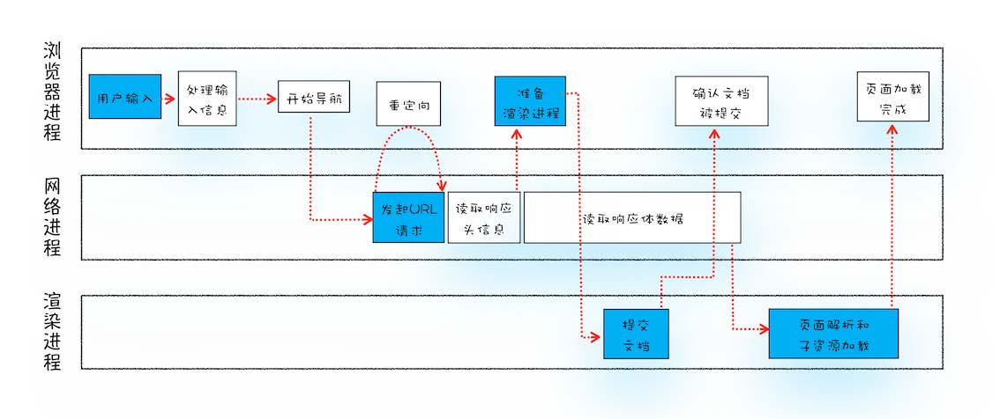
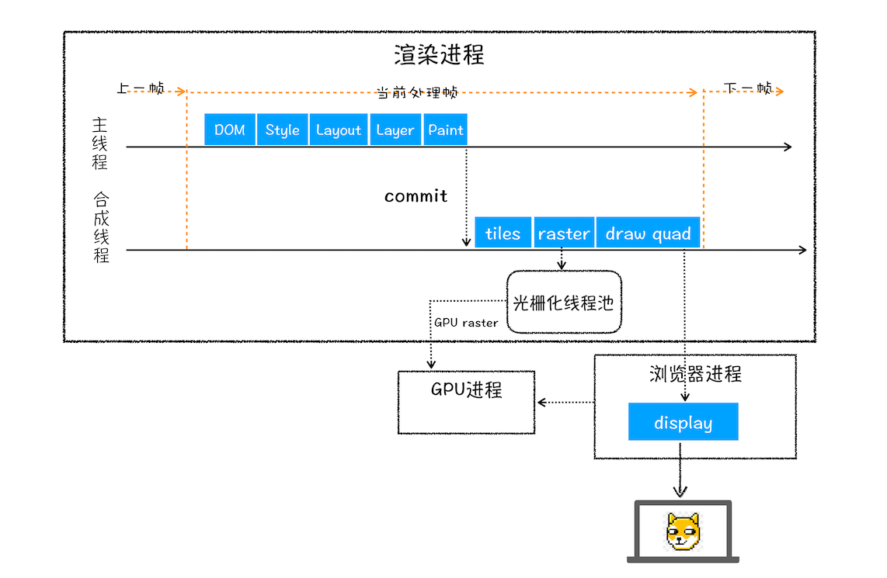
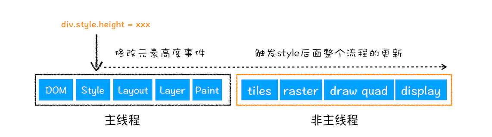
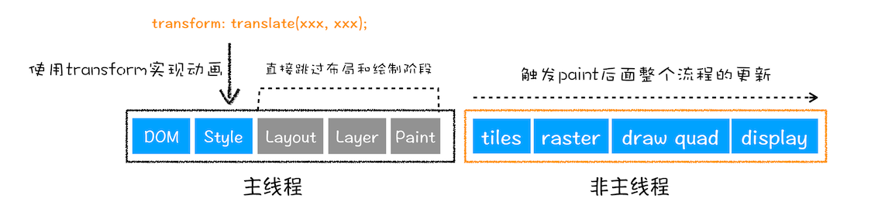

## 浏览器中输入URL后的工作流程

1. 浏览器进程主要负责用户交互、子进程管理和文件储存等功能。
2. 网络进程是面向渲染进程和浏览器进程等提供网络下载功能。
3. 渲染进程的主要职责是把从网络下载的 HTML、JavaScript、CSS、图片等资源解析为可以显示和交互的页面。

## 浏览器渲染机制

1. 解析与构建 DOM/CSSOM
    - HTML 解析
        - 浏览器逐行解析 HTML，生成 DOM 树（Document Object Model）。
        - 遇到 script 标签会阻塞解析，直到脚本下载并执行完毕（可通过 async/defer 属性优化）。
        - 遇到 link 或 style 标签会异步下载 CSS，但CSSOM 构建会阻塞渲染树生成。
    - CSS 解析
        - 解析 CSS 生成 CSSOM 树（CSS Object Model），包含所有样式规则（如选择器优先级、继承关系）
2. 构建渲染树（Render Tree）
    - 合并 DOM 和 CSSOM，生成包含可见节点及其样式的渲染树。
        - 排除 display: none 的元素，但保留 visibility: hidden 的元素（占布局空间）。
        - 伪类（如 :hover）和媒体查询可能动态影响渲染树。
3. 布局（Layout / Reflow）
    - 计算渲染树中每个节点的几何信息（位置、尺寸）
        - 基于视口（viewport）大小、设备像素比等参数。
        - 触发回流的操作：窗口缩放、DOM 结构变化、样式修改（如宽度/字体大小）。
4. 绘制（Painting）
    - 将布局结果转换为屏幕上的像素，包括文本、颜色、边框等视觉处理。
        - 可能分层绘制（如 z-index 控制层叠顺序）。
        - 触发重绘的操作：颜色、背景等不影响布局的样式变化。
5. 合成（Compositing）
    - 将各层（如单独图层、滚动区域）合并为最终图像，通过 GPU 加速处理。
        - 使用 transform 或 opacity 的动画会触发合成，跳过布局和绘制，性能更优。

## 重排、重绘、合成
1. 更新了元素的几何属性（重排）

2. 更新元素的绘制属性（重绘）

3. 直接合成阶段


## 阻塞渲染的情况
1. CSS 阻塞渲染，浏览器在构建渲染树时需要 CSSOM 树，而 CSS 文件的加载和解析会阻塞渲染。
    - 具体情况:
        - 外部 CSS 文件（```<link rel="stylesheet">```）未加载完成，浏览器会暂停渲染，直到 CSSOM 树构建完成。
        - 如果 CSS 文件体积大或网络延迟高，阻塞时间会延长。
    - 解决方法:
        - 使用 内联 CSS（将关键 CSS 写入 ```<style>``` 标签）减少外部请求。
        - 异步加载 CSS（如通过 JavaScript 动态加载）。
        - 优化 CSS 文件，减少体积和选择器复杂性。
2. JavaScript 阻塞渲染，浏览器在解析 HTML 时遇到 script 标签，默认会暂停 DOM 解析，等待脚本下载和执行完成。
    - 具体情况:
        - 外部 JavaScript 文件（```<script src="...">```）未加载完成。
        - 脚本执行时间长（如复杂计算或操作 DOM）。
        - 内联脚本（```<script>``` 标签内的代码）也会暂停解析。
    - 解决方法：
        - 使用 async 属性（```<script async src="...">```）：脚本异步加载，加载完成后立即执行，但不保证执行顺序。
        - 使用 defer 属性（```<script defer src="...">```）：脚本异步加载，延迟到 DOM 解析完成后执行，且按脚本顺序执行。
        - 将 ```<script>``` 标签放在 ```<body>``` 底部，减少对 DOM 解析的阻塞。
3. 字体加载阻塞，自定义字体（@font-face）加载时，浏览器可能延迟文本渲染。
    - 具体情况：
        - 如果字体文件未加载完成，浏览器可能隐藏文本（“FOIT”，Flash of Invisible Text）或显示回退字体（“FOUT”，Flash of Unstyled Text）。
    - 解决办法
        - 使用 font-display: swap 让浏览器在字体加载期间显示回退字体。
        - 预加载字体文件（```<link rel="preload" href="font.woff2" as="font">```）
        - 减少字体文件体积或使用系统字体。
4. 重排和重绘，某些操作触发浏览器重新计算布局或重绘页面，阻塞渲染。
    - 具体情况：
        - 修改 DOM 结构（如添加/删除节点）。
        - 修改影响布局的 CSS 属性（如 width、height、position）。
        - 频繁访问布局信息（如 offsetWidth、getBoundingClientRect）。
    - 解决方法：
        - 批量修改 DOM（如使用文档片段 DocumentFragment）。
        - 使用 CSS 动画（如 transform）替代触发重排的属性。
        - 缓存布局信息，避免重复读取。
5. 网络延迟和资源加载，外部资源的加载时间（如图片、视频、API 请求）可能延迟页面渲染。
    - 具体情况：
        - 大型图片或视频未加载完成。
        - 服务器响应缓慢导致资源不可用。
    - 解决方法：
        - 优化资源（如压缩图片、使用 CDN）。
        - 使用懒加载（loading="lazy"）延迟非关键资源加载。
        - 预加载关键资源（```<link rel="preload">```）。
6. 单线程执行的阻塞，JavaScript 和 DOM/CSSOM 的解析都在浏览器的主线程上运行，长时间的任务会阻塞渲染。
    - 具体情况：
        - 复杂的 JavaScript 计算任务。
        - 长时间的 DOM 操作或事件处理。
    - 解决方法：
        - 使用 Web Worker 将复杂计算移到后台线程。
        - 分割任务（如使用 requestAnimationFrame 或 setTimeout 分片执行）。
        - 优化事件处理，避免长时间阻塞。
## 内存空间
1. JavaScript执行过程中，主要有三种类型内存空间，分别是代码空间、栈空间、和堆空间
    - 代码空间：存储可执行代码
    - 栈空间：存储基本类型，存储的是小数据
    - 堆空间：存储引用类型，能存放很大的数据
2. v8的垃圾回收
    - 