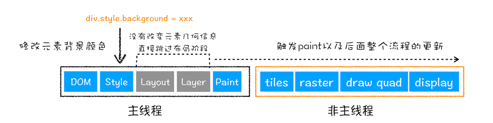

## 浏览器中输入URL后的工作流程

1. 浏览器进程主要负责用户交互、子进程管理和文件储存等功能。
2. 网络进程是面向渲染进程和浏览器进程等提供网络下载功能。
3. 渲染进程的主要职责是把从网络下载的 HTML、JavaScript、CSS、图片等资源解析为可以显示和交互的页面。

## 浏览器渲染机制

1. 解析与构建 DOM/CSSOM
    - HTML 解析
        - 浏览器逐行解析 HTML，生成 DOM 树（Document Object Model）。
        - 遇到 script 标签会阻塞解析，直到脚本下载并执行完毕（可通过 async/defer 属性优化）。
        - 遇到 link 或 style 标签会异步下载 CSS，但CSSOM 构建会阻塞渲染树生成。
    - CSS 解析
        - 解析 CSS 生成 CSSOM 树（CSS Object Model），包含所有样式规则（如选择器优先级、继承关系）
2. 构建渲染树（Render Tree）
    - 合并 DOM 和 CSSOM，生成包含可见节点及其样式的渲染树。
        - 排除 display: none 的元素，但保留 visibility: hidden 的元素（占布局空间）。
        - 伪类（如 :hover）和媒体查询可能动态影响渲染树。
3. 布局（Layout / Reflow）
    - 计算渲染树中每个节点的几何信息（位置、尺寸）
        - 基于视口（viewport）大小、设备像素比等参数。
        - 触发回流的操作：窗口缩放、DOM 结构变化、样式修改（如宽度/字体大小）。
4. 绘制（Painting）
    - 将布局结果转换为屏幕上的像素，包括文本、颜色、边框等视觉处理。
        - 可能分层绘制（如 z-index 控制层叠顺序）。
        - 触发重绘的操作：颜色、背景等不影响布局的样式变化。
5. 合成（Compositing）
    - 将各层（如单独图层、滚动区域）合并为最终图像，通过 GPU 加速处理。
        - 使用 transform 或 opacity 的动画会触发合成，跳过布局和绘制，性能更优。
## 重排、重绘、合成
1. 更新了元素的几何属性（重排）

2. 更新元素的绘制属性（重绘）

3. 直接合成阶段
