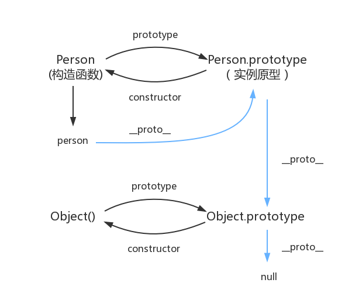

## this 

## 闭包
闭包（Closure）指的是一个函数能够访问并记住其词法作用域（Lexical Scope）即使这个函数在其词法作用域之外执行。换句话说，闭包让函数可以“捕获”并保存它定义时的作用域，即使在定义它的作用域已经销毁的情况下。(闭包是指有权访问另一个函数作用域中的变量的函数。简单来说，当一个内部函数引用了外部函数的变量时，就形成了闭包。)
闭包的核心在于：
- 函数嵌套：一个函数内部定义了另一个函数。
- 作用域链：内部函数可以访问外部函数的变量，即使外部函数已经执行完毕。
- 持久化变量：外部函数的变量在内部函数中被引用后，不会被垃圾回收机制销毁。
## 作用域链
当查找变量的时候，会先从当前上下文的变量对象中查找，如果没有找到，就会从父级(词法层面上的父级)执行上下文的变量对象中查找，一直找到全局上下文的变量对象，也就是全局对象。这样由多个执行上下文的变量对象构成的链表就叫做作用域链。
## 面向对象编程

## 原型及原型链

```js
// 构造函数
function Person() {}

// 实例
var person = new Person();
console.log(person.__proto__ === Person.prototype); // true
console.log(Person === Person.prototype.constructor); // true
console.log(Object.getPrototypeOf(person) === Person.prototype) // true
console.log(Object.prototype.__proto__ === null) // true 原型链顶端
```
## 前端异步编程

## 浏览器事件
### 浏览器事件模型
#### DOM事件

## 浏览器请求

## 模块化

## 函数式编程
### 什么是柯里化？
curry 的概念很简单：只传递给函数一部分参数来调用它，让它返回一个函数去处理剩下的参数。
你可以一次性地调用 curry 函数，也可以每次只传一个参数分多次调用。
```js
var add = function(x) {
  return function(y) {
    return x + y;
  };
};

var increment = add(1);
var addTen = add(10);

increment(2);
// 3

addTen(2);
// 12
```

## 垃圾回收 & 运行机制
1. 栈内存：由编译器直接控制，函数执行完毕时立即释放，无需垃圾回收算法。
    - 存储内容：原始类型、执行上下文
    - 分配方式：编译器自动分配
    - 回收机制：函数结束时直接释放
    - 性能开销：接近零开销（仅移动指针）
    - 内存碎片：无
2. 堆内存回收：由垃圾回收器通过标记清除等算法管理。
    - 存储内容：引用类型（对象、数组等）
    - 分配方式：动态分配（需 GC 介入）
    - 回收机制：标记清除、引用计数等算法
    - 性能开销：较高（需遍历对象图）
    - 内存碎片：可能存在（需内存整理）

## for of 与 for in 的区别