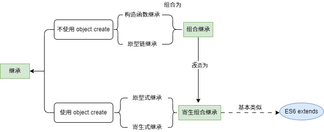
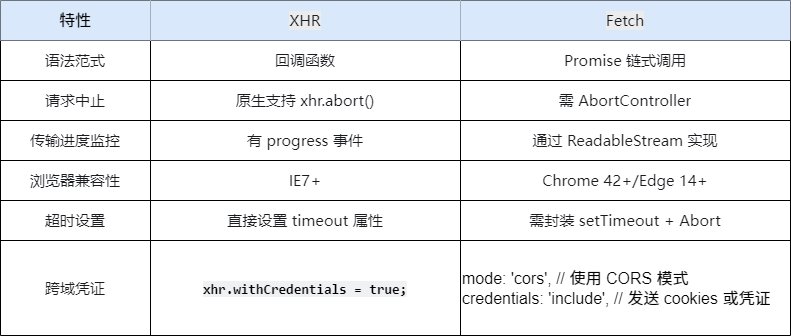

## this 

## 闭包
闭包（Closure）指的是一个函数能够访问并记住其词法作用域（Lexical Scope）即使这个函数在其词法作用域之外执行。换句话说，闭包让函数可以“捕获”并保存它定义时的作用域，即使在定义它的作用域已经销毁的情况下。(闭包是指有权访问另一个函数作用域中的变量的函数。简单来说，当一个内部函数引用了外部函数的变量时，就形成了闭包。)
闭包的核心在于：
- 函数嵌套：一个函数内部定义了另一个函数。
- 作用域链：内部函数可以访问外部函数的变量，即使外部函数已经执行完毕。
- 持久化变量：外部函数的变量在内部函数中被引用后，不会被垃圾回收机制销毁。
## 作用域链
当查找变量的时候，会先从当前上下文的变量对象中查找，如果没有找到，就会从父级(词法层面上的父级)执行上下文的变量对象中查找，一直找到全局上下文的变量对象，也就是全局对象。这样由多个执行上下文的变量对象构成的链表就叫做作用域链。
## 面向对象编程

## 原型及原型链

```js
// 构造函数
function Person() {}

// 实例
var person = new Person();
console.log(person.__proto__ === Person.prototype); // true
console.log(Person === Person.prototype.constructor); // true
console.log(Object.getPrototypeOf(person) === Person.prototype) // true
console.log(Object.prototype.__proto__ === null) // true 原型链顶端
```
## 前端异步编程

## 浏览器事件
### 浏览器事件模型
#### DOM事件

## 浏览器请求

## 模块化

## 函数式编程
### 什么是柯里化？
curry 的概念很简单：只传递给函数一部分参数来调用它，让它返回一个函数去处理剩下的参数。
你可以一次性地调用 curry 函数，也可以每次只传一个参数分多次调用。
```js
var add = function(x) {
  return function(y) {
    return x + y;
  };
};

var increment = add(1);
var addTen = add(10);

increment(2);
// 3

addTen(2);
// 12
```
## 继承
1. 原型链继承
```js
// 定义父构造函数
function Parent() {
    this.parentProperty = 'This is a parent property';
    this.parentMethod = function () {
        console.log('This is a parent method');
    };
}

// 定义子构造函数
function Child() {
    this.childProperty = 'This is a child property';
}

// 设置子构造函数的原型为父构造函数的实例
Child.prototype = new Parent();

// 创建子对象
const child = new Child();

// 访问继承的属性和方法
console.log(child.parentProperty); 
child.parentMethod(); 
```
 - 在上述代码中：
    - 定义父构造函数 Parent：在构造函数内部定义了属性 parentProperty 和方法 parentMethod。
    - 定义子构造函数 Child：在构造函数内部定义了属性 childProperty。
    - 设置原型链：通过 Child.prototype = new Parent(); 将 Child 构造函数的原型设置为 Parent 构造函数的一个实例。这样，Child 的实例就可以通过原型链访问到 Parent 实例的属性和方法。
    - 创建子对象：使用 new Child() 创建一个 Child 的实例 child。
    - 访问继承的属性和方法：通过 child 对象可以访问到 parentProperty 属性和 parentMethod 方法，这表明 child 对象通过原型链继承了 Parent 实例的属性和方法。
 - 原型链继承的优缺点
    - 优点
      - 实现简单：只需要设置原型对象，就能让对象继承其他对象的属性和方法，代码简洁易懂。
      - 可共享属性和方法：多个实例可以共享原型对象上的属性和方法，节省内存空间。
    - 缺点
      - 引用类型属性共享问题：如果原型对象中包含引用类型的属性，那么所有实例都会共享这个属性，一个实例对该属性的修改会影响其他实例。
      - 创建子实例时无法向父构造函数传参：在设置原型时，直接创建了父构造函数的实例，无法在创建子实例时向父构造函数传递参数。

2. 构造函数继承(借助 call)
```js
function Parent(){
  this.name = 'parent1';
  this.sayHello = function() {
        console.log('Hello!');
  };
}
Parent.prototype.getName = function () {
  return this.name;
}
function Child(){
  Parent.call(this);
  this.type = 'child'
}
let child = new Child(); 
let child2 = new Child();
console.log(child.sayHello === child2.sayHello);// false
console.log(child);  // Child {name: 'parent1', type: 'child'}
console.log(child.getName()); //Uncaught TypeError: child.getName is not a function at <anonymous>
```
- 构造函数继承优缺点
  - 优点
    - 能解决原型链继承中引用类型属性共享的问题
  - 缺点
    - 方法无法复用：Parent 构造函数里定义了 sayHello 方法。在 Child 构造函数中使用 Parent.call(this) 调用 Parent 构造函数，这样每个 Child 实例都会有自己的 sayHello 方法副本。通过 child1.sayHello === child2.sayHello 比较可以发现，这两个方法并非同一个引用，说明方法无法复用。
    - 无法继承父类原型上的属性和方法

3. 组合继承
  - 将构造函数继承和原型链继承结合
4. 原型式继承
  - 原型式继承的基本原理是创建一个新对象，将该对象的原型设置为另一个对象，从而让新对象继承该对象的属性和方法。在 ES5 之后，可以使用 Object.create() 方法来实现这一功能。
```js
// 定义一个原型对象
const personPrototype = {
    sayHello: function() {
        console.log(`Hello, my name is ${this.name}.`);
    }
};

// 使用 Object.create() 创建一个新对象
const person1 = Object.create(personPrototype);
person1.name = 'John';

// 调用继承的方法
person1.sayHello(); 

```
在 ES5 之前，没有 Object.create() 方法，可以通过自定义函数来模拟实现类似的功能：
```js
function createObject(prototype) {
    function F() {}
    F.prototype = prototype;
    return new F();
}

// 定义一个原型对象
const animalPrototype = {
    makeSound: function() {
        console.log('Some animal sound');
    }
};

// 使用自定义函数创建一个新对象
const animal1 = createObject(animalPrototype);
animal1.makeSound(); 
```
  - 原型式继承的优缺点
    - 优点
      - 实现简单：只需要借助 Object.create() 方法或者自定义一个简单的函数，就能实现对象的继承。
      - 灵活：可以在运行时动态地创建新对象，并继承指定的原型对象。
    - 缺点
      - 引用类型属性共享问题：因为object.create()方法实现的是浅拷贝，与原型链继承类似，如果原型对象中包含引用类型的属性，那么所有继承自该原型对象的新对象都会共享这个属性，一个对象对该属性的修改会影响其他对象。
5. 寄生式继承
```js
// 定义一个原型对象
const personPrototype = {
    sayHello: function() {
        console.log(`Hello, my name is ${this.name}.`);
    }
};

// 寄生式继承函数
function createPerson(name) {
    // 使用原型式继承创建一个新对象
    const person = Object.create(personPrototype);
    // 为新对象添加额外的属性
    person.name = name;
    // 为新对象添加额外的方法
    person.sayGoodbye = function() {
        console.log(`Goodbye!`);
    };
    return person;
}

// 创建一个新的 person 对象
const person1 = createPerson('John');

// 调用继承的方法
person1.sayHello(); 
// 调用新增的方法
person1.sayGoodbye(); 
```
 - 寄生式继承的优缺点
  - 优点
    - 灵活性高：可以在创建对象的同时为其添加额外的属性和方法，对对象进行定制化扩展。
    - 代码复用：基于原型式继承，能够复用原型对象的属性和方法，减少代码冗余。
  - 缺点
    - 方法无法复用：与构造函数继承类似，每个通过寄生式继承创建的对象都会有自己独立的方法副本，造成内存浪费。
    - 引用类型属性共享问题：如果原型对象中包含引用类型的属性，所有继承自该原型对象的新对象都会共享这个属性，一个对象对该属性的修改会影响其他对象。
6. 寄生组合式继承
```js
// 定义父类构造函数
function Parent(name) {
    this.name = name;
    this.hobbies = ['reading', 'swimming'];
}

// 为父类原型添加方法
Parent.prototype.sayName = function () {
    console.log(`My name is ${this.name}`);
};

// 定义子类构造函数
function Child(name, age) {
    // 调用父类构造函数，继承父类实例属性
    Parent.call(this, name);
    this.age = age;
}

// 寄生组合式继承的核心函数
function inheritPrototype(childConstructor, parentConstructor) {
    // 创建一个新对象，其原型为父类的原型
    const prototype = Object.create(parentConstructor.prototype);
    // 修正 constructor 属性
    prototype.constructor = childConstructor;
    // 将子类的原型设置为这个新对象
    childConstructor.prototype = prototype;
}

// 执行寄生组合式继承
inheritPrototype(Child, Parent);

// 为子类原型添加方法
Child.prototype.sayAge = function () {
    console.log(`I'm ${this.age} years old`);
};

// 创建子类实例
const child = new Child('Alice', 18);

// 调用继承的方法
child.sayName();
child.sayAge();
console.log(child.hobbies);    
```
- 寄生组合式继承的优缺点
  - 优点
    - 减少构造函数调用次数：避免了组合继承中两次调用父类构造函数的问题，提高了性能。
    - 原型链完整：可以完整地继承父类原型上的方法和属性。
  缺点
    - 实现相对复杂：相较于其他一些简单的继承方式，代码实现上需要更多步骤和理解成本。
es6的extends继承的语法糖就是寄生组合式继承
```js
// 定义父类
class Parent {
    constructor(name) {
        this.name = name;
        this.hobbies = ['reading', 'swimming'];
    }

    sayName() {
        console.log(`My name is ${this.name}`);
    }
}

// 定义子类，使用 extends 关键字继承父类
class Child extends Parent {
    constructor(name, age) {
        // 调用父类的构造函数，继承父类的实例属性 在子类构造函数中调用 super 时是否传递参数，要依据父类构造函数是否需要参数来决定。
        super(name);
        this.age = age;
    }

    sayAge() {
        console.log(`I'm ${this.age} years old`);
    }
}

// 创建子类实例
const child = new Child('Alice', 18);

// 调用继承的方法
child.sayName();
child.sayAge();

console.log(child.hobbies);
    
```

## 垃圾回收 & 运行机制
## 作用域链
当查找变量的时候，会先从当前上下文的变量对象中查找，如果没有找到，就会从父级(词法层面上的父级)执行上下文的变量对象中查找，一直找到全局上下文的变量对象，也就是全局对象。这样由多个执行上下文的变量对象构成的链表就叫做作用域链。
## 面向对象编程

## 原型及原型链

```js
// 构造函数
function Person() {}

// 实例
var person = new Person();
console.log(person.__proto__ === Person.prototype); // true
console.log(Person === Person.prototype.constructor); // true
console.log(Object.getPrototypeOf(person) === Person.prototype) // true
console.log(Object.prototype.__proto__ === null) // true 原型链顶端
```
## 前端异步编程

## 浏览器事件
### 浏览器事件模型
#### DOM事件

## 浏览器请求

## 模块化

## 函数式编程
### 什么是柯里化？
curry 的概念很简单：只传递给函数一部分参数来调用它，让它返回一个函数去处理剩下的参数。
你可以一次性地调用 curry 函数，也可以每次只传一个参数分多次调用。
```js
var add = function(x) {
  return function(y) {
    return x + y;
  };
};

var increment = add(1);
var addTen = add(10);

increment(2);
// 3

addTen(2);
// 12
```

## 垃圾回收 & 运行机制
1. 栈内存：由编译器直接控制，函数执行完毕时立即释放，无需垃圾回收算法。
    - 存储内容：原始类型、执行上下文
    - 分配方式：编译器自动分配
    - 回收机制：函数结束时直接释放
    - 性能开销：接近零开销（仅移动指针）
    - 内存碎片：无
2. 堆内存回收：由垃圾回收器通过标记清除等算法管理。
    - 存储内容：引用类型（对象、数组等）
    - 分配方式：动态分配（需 GC 介入）
    - 回收机制：标记清除、引用计数等算法
    - 性能开销：较高（需遍历对象图）
    - 内存碎片：可能存在（需内存整理）

## for of 与 for in 的区别

## JavaScript数字精度
```js
0.1 + 0.2 === 0.3 //false
```
在JavaScript语言中，数字计算都是转化成二进制后再进行运算，计算机存储双精度浮点数需要先把十进制数转换为二进制的科学记数法的形式，然后计算机以自己的规则｛符号位+（指数位+指数偏移量的二进制）+小数部分｝存储二进制的科学记数法
因为存储时有位数限制（64位），并且某些十进制的浮点数在转为二进制数时会出现无限循环，会造成二进制的舍入操作（0舍入1），当再转换为十进制时就造成了计算误差。

### 数字精度解决方案
1. 使用toPrecision凑整并parseFloat转换成数字后再显示，如下：
```js
parseFloat(1.4000000000000000001.toPrecision(12)) === 1.4 //true
// 封装成方法
function strip(num, precision = 12) ｛
  return +parseFloat(num.toPrecision(precision));
｝
```
2. 小数转为整数后在进行运算
3. 使用第三方库 Math.js, BigDecimal.js

## xhr和fetch区别
