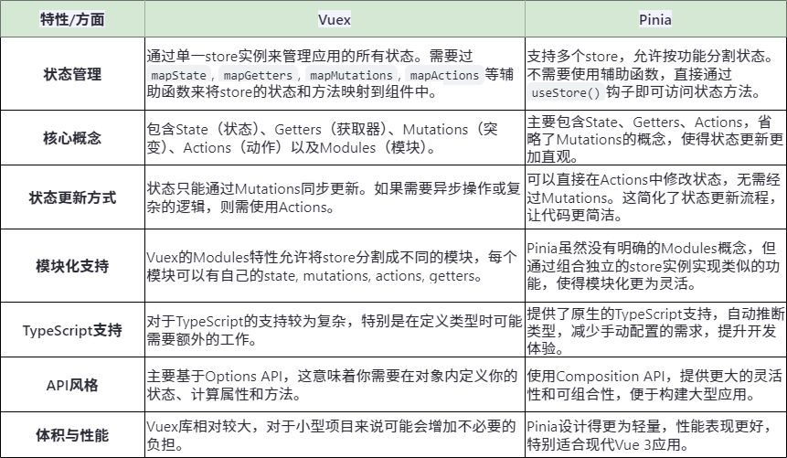

# vue3核心模块源码解析
## 在 Vue 2 和 Vue 3 中，v-model 都是用于实现双向数据绑定的指令，但二者存在一些区别
### 语法糖本质
1. Vue 2：v-model 是 :value 和 @input 的语法糖。也就是说，在 Vue 2 里，v-model 会自动绑定 value 属性，并且监听 input 事件。示例如下：
```vue
<template>
  <!-- 以下两种写法等价 -->
  <input v-model="message">
  <input :value="message" @input="message = $event.target.value">
</template>

<script>
export default {
  data() {
    return {
      message: ''
    };
  }
};
</script>
```
2. Vue 3：v-model 是 :modelValue 和 @update:modelValue 的语法糖。这意味着在 Vue 3 中，v-model 默认绑定的是 modelValue 属性，监听的是 update:modelValue 事件。示例如下：
```vue
<template>
  <!-- 以下两种写法等价 -->
  <input v-model="message">
  <input :modelValue="message" @update:modelValue="message = $event">
</template>

<script setup>
import { ref } from 'vue';
const message = ref('');
</script>
```
### 自定义组件上使用v-model
1. Vue 2：要在自定义组件上使用 v-model，需要在组件内通过 model 选项来指定绑定的属性和事件。示例如下：
```vue
<!-- 父组件 -->
<template>
  <MyComponent v-model="parentValue" />
</template>

<script>
import MyComponent from './MyComponent.vue';
export default {
  components: {
    MyComponent
  },
  data() {
    return {
      parentValue: ''
    };
  }
};
</script>

<!-- 子组件 MyComponent.vue -->
<template>
  <input :value="value" @input="$emit('input', $event.target.value)">
</template>

<script>
export default {
  model: {
    prop: 'value',
    event: 'input'
  },
  props: {
    value: String
  }
};
</script>
```
2. Vue 3：在自定义组件上使用 v-model 时，无需再使用 model 选项。默认情况下，v-model 绑定 modelValue 属性并监听 update:modelValue 事件。同时，Vue 3 支持在一个组件上使用多个 v-model 绑定。示例如下：
```vue
<!-- 父组件 -->
<template>
  <MyComponent v-model="parentValue" v-model:title="parentTitle" />
</template>

<script setup>
import { ref } from 'vue';
import MyComponent from './MyComponent.vue';
const parentValue = ref('');
const parentTitle = ref('');
</script>

<!-- 子组件 MyComponent.vue -->
<template>
  <input :modelValue="modelValue" @update:modelValue="$emit('update:modelValue', $event)">
  <input :modelValue="title" @update:modelValue="$emit('update:title', $event)">
</template>

<script setup>
import { defineProps, defineEmits } from 'vue';
const props = defineProps({
  modelValue: String,
  title: String
});
const emits = defineEmits(['update:modelValue', 'update:title']);
</script>
```
### 修饰符的使用
1. Vue 2：v-model 有一些内置修饰符，如 .lazy、.number 和 .trim，但扩展自定义修饰符比较复杂。
2. Vue 3：除了保留 Vue 2 的内置修饰符外，还能更方便地创建自定义修饰符。示例如下：
```vue
<template>
  <input v-model.capitalize="message">
</template>

<script setup>
import { ref } from 'vue';
const message = ref('');

// 这个示例是用户在输入框中输入内容时，会自动将输入内容的首字母转换为大写并将转换后的内容同步到 message 变量中，实现了双向数据绑定的同时，添加了自定义的输入处理逻辑。
const vModelCapitalize = {
  created(el, binding, vnode) {
    const { modifiers } = binding;
    if (modifiers.capitalize) {
      el.addEventListener('input', (e) => {
        const value = e.target.value;
        const capitalized = value.charAt(0).toUpperCase() + value.slice(1);
        vnode.props['onUpdate:modelValue'](capitalized);
      });
    }
  }
};
</script>
```

## vue几个关键的核心包
1. @vue/compiler-sfc 用于编译vue的SFC文件，这个包依赖vue下的其他包，比如@vue/compiler-dom和@vue/compiler-core。这个包一般是给vue-loader 和 @vitejs/plugin-vue使用的。负责将 .vue 文件中的 template、script 和 style 部分提取并编译为可以在浏览器中运行的 JavaScript 代码。
    - 通常情况下，在使用构建工具（如 Vite 或 Webpack）时，@vue/compiler-sfc 会作为依赖的一部分自动被引入并使用。然而，在某些特殊场景下（例如直接在浏览器中加载 .vue 文件），你可能需要手动使用 @vue/compiler-sfc 来处理 .vue 文件。
2. @vue/compiler-dom 这个包专注于浏览器端的编译，处理浏览器dom相关的逻辑都在这里面。
3. @vue/compiler-core 这个包是vue编译部分的核心，提供了通用的编译逻辑，不管是浏览器端还是服务端编译最终都会走到这个包里面来。

## vue文件如何渲染到浏览器上
1. 通过webpack或者vite将一个vue文件编译为一个包含render函数的js文件。然后执行render函数生成虚拟DOM，再调用浏览器的DOM API根据虚拟DOM生成真实DOM挂载到浏览器上。
2. .vue文件编译后的代码中已经没有了template标签和script标签，取而代之的是render函数和__sfc__对象。并且使用__sfc__.render  = render将render函数挂载到__sfc__对象上、然后将__sfc__对象export default出去，__scc__对象中包含render方法和setup方法
3. 在浏览器中可以借助 vue3-sfc-loader 它允许你在不使用构建工具（如 Vite 或 Webpack）的情况下，直接通过 script 标签引入 .vue 文件，并将其渲染到页面上。

## vue3的宏到底是什么东西？
从vue3开始vue引入了宏，比如defineProps、defineEmits等。我们每天写vue代码时都会使用到这些宏，但是你有没有思考过vue中的宏到底是什么？为什么这些宏不需要手动从vue中import？为什么只能在setup顶层中使用这些宏？
1. vue中的宏到底是什么？
    - vue3的宏是一种特殊的代码，在编译时会将这些特殊的代码转换为浏览器能够直接运行的指定代码，根据宏的功能不同，转换后的代码也不同。
2. 为什么这些宏不需要手动从vue中import？
    - 因为在编译时已经将这些宏替换为指定的浏览器能够直接运行的代码，在运行时已经不存在这些宏相关的代码，自然不需要从vue中import。
3. 为什么只能在setup顶层中使用这些宏？
    - 因为在编译时只会去处理setup顶层的宏，其他地方的宏会原封不动的输出回来。在运行时由于我们没有在任何地方定义这些宏，当代码执行到宏的时候当然就会报错。

## 生命周期
## vue组件库项目架构设计
## vue3中如何像vue2一样注册全局使用的属性和方法 
```js
// vue2
Vue.prototype.$http = () => {}
this.$http()

// vue3
const app = createApp(App).mount("#app")
app.config.globalProperties.$http = () =>{}
setup(){
  const { $http } = getCurrentInstance()
}
```

## vuex和pinia


## vue2和vue3
1. Composition Api
  - vue3：引入Composition Api，提供了更灵活的逻辑复用。
  - vue2：Options API，通过选项（如 data、methods、computed 等）来组织组件逻辑，缺少一种比较干净的的在多个组件之间提取和复用逻辑的机制
2. 性能提升
  - 体积优化
    * 移除一些不常用的API
    * 引入tree-shaking机制打包体积更小，因为vue2项目是单列的
  - 编译优化
    * diff算法优化：vue3在diff算法中增加了静态标记，在会发生变化的地方添加一个flag标记，下次发生变化的时候直接找该地方进行比较
    * 静态提升：vue3中对不参与更新的元素，会做静态提升，只会创建一次，在渲染时直接复用。
    * 事件监听缓存：
    * SSR优化：当静态内容大到一定量级的时候，会用createStaticVNode方法在客户端去生成一个static node，这些静态node，会被直接innerHtml，就不需要创建对线，然后根据对象渲染。
  - 响应式系统
    * 在vue2中，数据劫持是通过Object.defineProperty,这个API不能检测对象属性的添加和删除。而且在面对嵌套层级比较深的情况下，就存在性能问题。
    * vue3是通过proxy监听整个对象，它并不能监听到内部深层次的对象变化，vue3的处理方式是在getter中去递归响应式，这样的好处是真正访问到内部对象才会变成响应式，而不是无脑递归。
3. 优化方案
  - 源码
    * 源码管理，使用了monorepo的方式维护代码，根据功能将不同的模块拆分到packages目录下面的不同子目录中，使得模块拆分更细化，易于理解和维护，reactivity响应式库是可以独立于Vue使用的，方便使用。
    * Typescript，基于ts编写，提供了更好的类型检查，支持更复杂类型推导